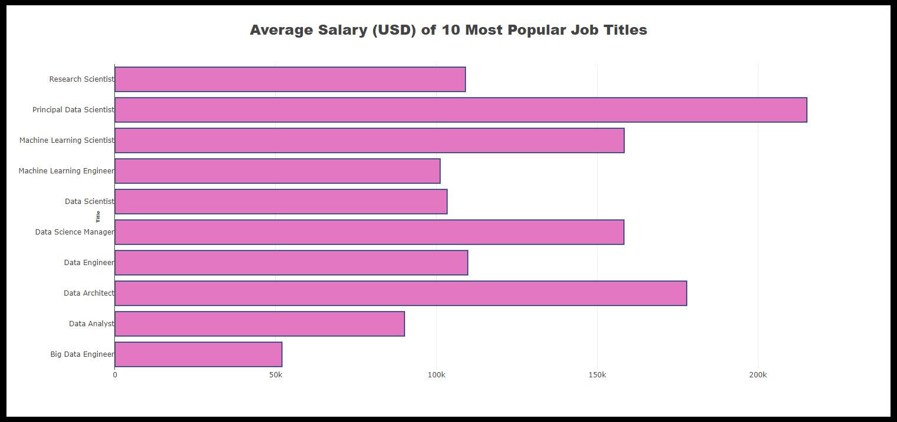

# Data Science/ Analytics Job Data Visualization Dashboard
Group 15, Project 3
Group Members:
 Heather Adams,
 Meena Rai,
 Tesa Childs-Skelton,
 Timea Jakab     
		    
# Overview
Given the present climate and its impact oo the current job market like layoffs, revaluations and worries about the economy, it’s a safe bet to focus on analyzing the most high demand job skills. Some jobs appear to be bearing the brunt of layoffs on the other hand there are many career paths that are considered to be safer bets. According to the U.S. Labor Department, around 40 million technical jobs go unfulfilled due to a lack of skilled talent (add link).  

Our project focused on creating a Flask Application to analyze DATA Science/ Analytics Jobs data to see which specific roles are in high-demand, average salary distribution per role, job attributes (onsite, remote, hybrid), location and current postings. Hopefully this will help our fellow classmates make an educated decision on picking roles have a high growth opportunity and might be a safer picks during a potential recession.

# Methodology
For this project two data sets from Kaggle were used:  

    * ds_salaries.csv (https://www.kaggle.com/code/hamdy17298/eda-on-data-science-jobs-salaries/data) - describe (year, demografics, rows). 
    
    * linkedin-jobs-africa.csv (https://www.kaggle.com/datasets/cedricaubin/linkedin-data-analyst-jobs-listings) - describe (year, demografics, rows). 
    
* Back end tools - Python, Sqlite Database
* Front end tools - JS, CSS, HTML

## Flask Application Structure (insert flow chart)
    * Data
    * jobs.ipynb
    * app.py
    * static
        *js
        *css
        *images
    * templates
        *html
    
## Extracted and Wrangled Data
* Data (csv files) was extracted from the above mentioned sources and loaded  into Pandas dataframes using Python.
* Data was transform as per Dahboard requirements. Below are the list of transformations performed:
    * Checked and dropped (if any) null values
    * Checked and dropped (if any) duplicates
    * Renamed colums/ cells of a column for user freindly visualization
    * Droped undesired columns
    * Used googlemaps API to add coordinates (lattitude and longitude) of the job locations for job posting visualization
    * Converted lattitude and longitude to float types 

## Loaded Wrangeled data in sqlite Database
Loaded the cleaned dataframes into sqlite databse: 
    * [Job Statistics Database](data/jobstats_db.sqlite)
    * [US Job Posting Database](data/updated_jobs_usa_db.sqlite)

## Created Backend for the app
* Following API routes were created for the "js" files by connecting and quering the database:
    * @app.route("/api/word_data")
    * @app.route("/api/salary_data")
    * @app.route("/api/attribute_data")
    * @app.route("/api/country_data")
    * @app.route("/api/map_data")

* Following web routes were created for template rendering: 
    * @app.route("/")
    * @app.route("/salary")
    * @app.route("/attribute")
    * @app.route("/country")
    * @app.route("/map")
* [app.py](app.py)
    

## Created Frontend for the app
* Visualization functions were created using following JS libraries:
    * Plotly js 
    * leaflet js
    * Chart js 
* [JS files](static/js)

* Visualization styling was done using following css libraries:
    * Style css
    * Bootstrap min css
* [CSS files](static/css)

* Web pages with navbar were created using HTML. Visualization contains following user-driven interactions:
    * Button
    * Dropdown
    * Onclick
    * Hover over
    * Link
* [HTML files](templates)

## Dashboard
A dashboard with five visualizations was created:

### Dashboard Landing Page
Landing page  has the following components:
    * A navigation bar
    * A word cloud chart displaying common data job titles as per MARKET DEMAND
    * An explaination of the project purpose  
    * Bottom navigation bar images link to their visualization page
    * RESOURCES
    * TEAM MEMBERS

### Salary Data Visualization
Salary Data Visualization has the following components:
    * A navigation bar
    * A bar chart displaying average salary distribution per job title
    * CHART SUMMARY 

### Attribute Data Visualization
Attribute Data Visualization has the following components:
    * A navigation bar
    * A pie chart displaying ratio of onsite/ remote/ hybrid jobs
    * CHART SUMMARY 

### Country Data Visualization
Country data Visualization has the following components:
    * A navigation bar
    * A tree map displaying proportion of job postings per country
    * CHART SUMMARY

### Job Posting Data Visualization
* Job posting data Visualization has the following components:
    * A navigation bar
    * A map displaying recent data science job postings (Linked In) with following pop ups:
        * Job title
        * Company
        * Attribute (onsite/ remote/ hybrid)
        * Location
        * Posted Date
        * Hyperlink for the posting

## Resources
* https://www.kaggle.com/code/hamdy17298/eda-on-data-science-jobs-salaries/data
* https://www.kaggle.com/datasets/cedricaubin/linkedin-data-analyst-jobs-listings 
* OpenWeatherMap.org. (2012). Сurrent weather and forecast. Retrieved from https://openweathermap.org/ Links to an external site. 
